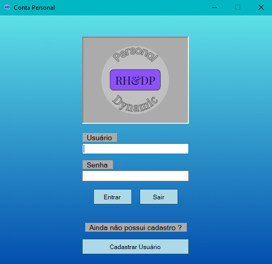
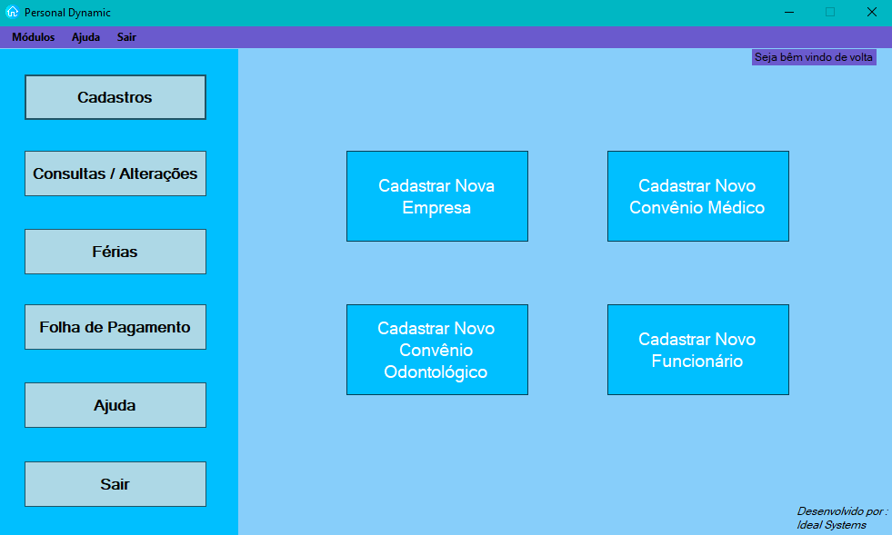
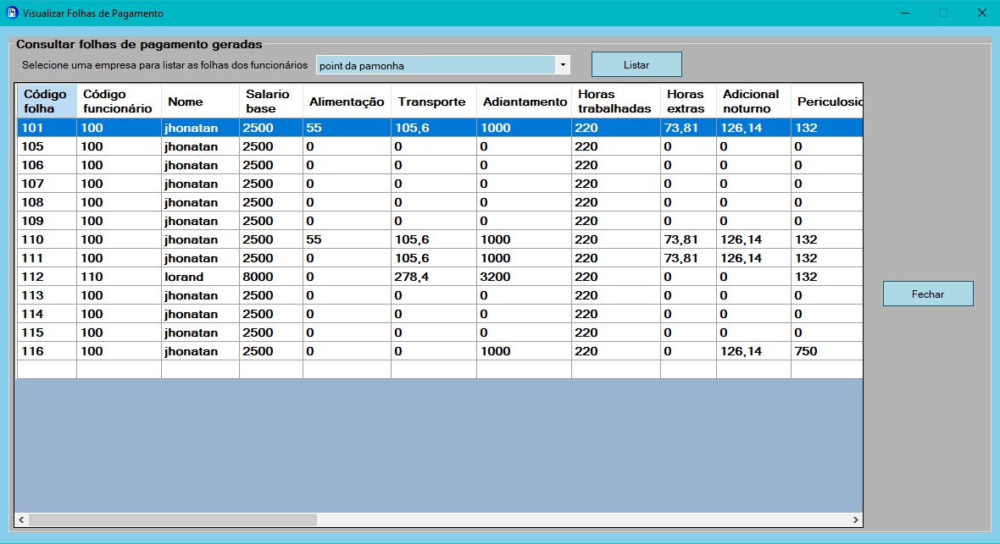
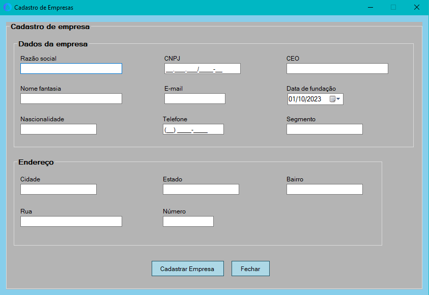

# Project: Personal Dynamic

## Tecnologies:
   

## Objective:
    This project was made for my graduation in Systems Analysis and Development.
    I needed to develop a system to calculate a payroll and vacations for a fictitious company.

    how this is my first project i won't refatorate because to be useful to show my before after in my evolution how software developer.

## This project do
    1. CRUD of employees and companyes
    2. Calculate payment paper
    3. Calculate vacations 
## Screenshots
    This is login interface.

    Home interface

    Consult payment paper data interface

    Company registration interface

